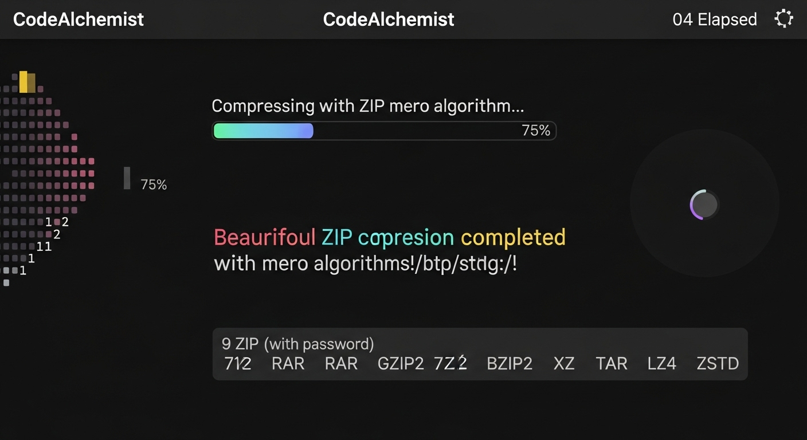

#  CodeAlchemist - غير لغه اداتك 

**: mero | Telegram: [@qp4rm](https://t.me/qp4rm)**

---

##  شو هاي الأداة؟

يا خوي، **CodeAlchemist** أداة بتترجم الكود من لغة للتانية وبتضغط الملفات بخوارزميات معينه وبخيرات طبعا انت بتختارها زيب ولا شو كله موجود 

**96+ لغة

### BY mero

#### ️ ترجمة الكود 
- **by mero
- ترجمة Functions، Variables، Loops، Conditions
- دعم: Python، Java، C++، JavaScript، Go، Rust، PHP، Ruby، Swift 

#### ️2 ضغط الملفات 
**9 صيغ ضغط** 

| الصيغة |            المميزات          | الاستخدام |
|--------|---------|-----------|
| **ZIP** |  دعم Password بتشفير AES | ملفات عامة |
| **7Z** |  أقوى ضغط بخوارزميات خاصه | ضغط |
| **RAR** |  ضغط عالي | ملفات كبيرة |
| **GZIP** |  سريع ومضبوط | ملفات Linux |
| **BZIP2** |  اشي نص نص| ضغط نصوص |
| **XZ** |  ألا تستخدمه الئ الملفات لكبيرا لنه لهيك مخصص | أفضل نسبة ضغط يعني ملفات كبيرا وهيك|
| **TAR** |  أرشفة | دمج ملفات |
| **LZ4** |  السرعة | ضغط لحظي |
| **ZSTD** |توازني | توازن مثالي |

## اذا عندك مشكله ارسلي تيلجرم QP4RM




---

##  كيف تشغل الأداة؟

**أسهل إشي**

```bash
git clone https://github.com/6x-u/CodeAlchemist.git
cd CodeAlchemist
pip install -r requirements.txt
python run.py
الملف run.py بيثبت كل المكتبات لحاله وبيشغل الأداة،

المكتبات المطلوبة (تثبيت تلقائي):
rich - واجهة Terminal جميلة

py7zr - ضغط 7Z

pyzipper - تشفير ZIP

 اللغات المدعومة (96 لغة!)
<details> <summary><b>اضغط هنا لعرض كل اللغات 👇</b></summary>
mathematica
نسخ الكود
Python, Java, C, C++, C#, JavaScript, TypeScript, Go, Rust, Ruby, 
PHP, Swift, Kotlin, Dart, Objective-C, Scala, Perl, Lua, Haskell, 
R, MATLAB, Julia, Shell/Bash, PowerShell, F#, Elm, Groovy, Erlang, 
Visual Basic .NET, SQL, Assembly (x86), Assembly (ARM), Fortran, 
COBOL, Ada, Prolog, Lisp, Scheme, Clojure, OCaml, Smalltalk, 
Pascal, Delphi, Crystal, Nim, VHDL, Verilog, ActionScript, Apex, 
ABAP, D, Racket, Tcl, Solidity, Hack, CoffeeScript, Batch, Forth, 
AWK, PostScript, OpenCL, CUDA, GLSL, Haxe, IDL, J, K, Nemerle, 
Pike, PL/I, Rexx, Seed7, Simula, SPARK, SPSS, Stata, Vala, XSLT, 
Yorick, Zig, Chapel, Coq, LiveScript, Mercury, Pony, PureScript, 
Red, Rebol, Ring, Sather, Turing, Wren
</details>
الأداة فيها تقنيات ضغط

تقنيات الضغط:
Entropy Calculation - حساب الإنتروبيا للبيانات

Block Size Optimization - تحسين حجم البلوك ديناميكياً

Delta Encoding - ترميز الفروقات

RLE Preprocessing - ضغط التكرارات

Mathematical Compression - خوارزميات

الأمان:
تشفير AES-256 للملفات المضغوطة بـ ZIP

Passwords قوية وآمنة

أمثلة الاستخدام
مثال 1: ترجمة كود Python إلى JavaScript
bash
نسخ الكود
python run.py
# اختر: 1. Code Translation Tool
# أدخل: path/to/script.py
# اختر لغة الهدف: JavaScript
# النتيجة: script_translated.js 
مثال 2: ضغط مجلد بـ ZIP مع Password
bash
نسخ الكود
python run.py
# اختر: 2. Folder Compression Tool
# أدخل: path/to/folder
# اختر: ZIP
# أدخل Password: ******
# النتيجة: CodeAlchemist.zip (مشفر AES)
مثال 3: ضغط ضغط قوي يعني(7Z)
bash
نسخ الكود
python run.py
# اختر: 2. Folder Compression Tool
# أدخل: path/to/folder
# اختر: 7Z
# النتيجة: CodeAlchemist.7z (أصغر حجم ممكن!)
ملاحظات مهمة
الموضوع	التفاصيل
Password	متوفر فقط لـ ZIP (تشفير AES)
الملفات المترجمة	تُحفظ بنفس المجلد مع اللاحقة _translated
الملفات المضغوطة	اسمها CodeAlchemist.[ext]
Credits	تضاف تلقائياً لكل ملف حسب نوع اللغة
Offline	تعمل بدون إنترنت تماماً!

👨‍💻 المطور
mero
 Telegram: @qp4rm

حط نجمه عل مشروع فضلا وليس امرا

</div> ```